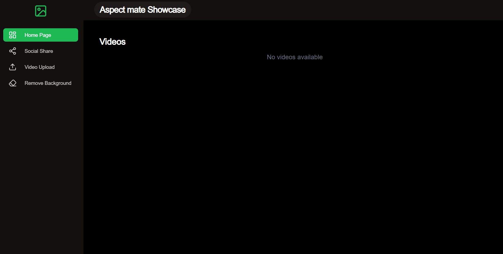

# Aspect Mate SaaS Application

Aspect Mate is a powerful SaaS application designed to simplify your media management with tools for uploading, transforming, and downloading images and videos. Built using modern web technologies, Aspect Mate offers an intuitive and streamlined experience for all your media needs.

## Features

- **Image Upload & Transformation**: Effortlessly upload and transform images using Cloudinary integration.
- **Video Management**: Seamlessly manage your video uploads and transformations.
- **Background Removal**: Remove backgrounds from images with ease.
- **Protected Routes**: All routes are protected, ensuring secure access to the application's main functionalities.

## Tech Stack

The application is built with the following technologies:

- **Framework**: [Next.js](https://nextjs.org/) - A React framework for production.
- **Cloud Services**: [Cloudinary](https://cloudinary.com/) - For media management and transformation.
- **Authentication**: [Clerk](https://clerk.dev/) - Authentication and user management.
- **Database**: [Prisma](https://www.prisma.io/) - ORM for interacting with the database.
- **Styling**: [Tailwind CSS](https://tailwindcss.com/) & [Daisy UI](https://daisyui.com/) - For styling and UI components.
- **React Icons**: [Lucide Icons](https://lucide.dev/) - For modern and customizable icons.
- **Utilities**: [Day.js](https://day.js.org/) for date handling, and [Filesize](https://filesizejs.com/) for file size calculations.
